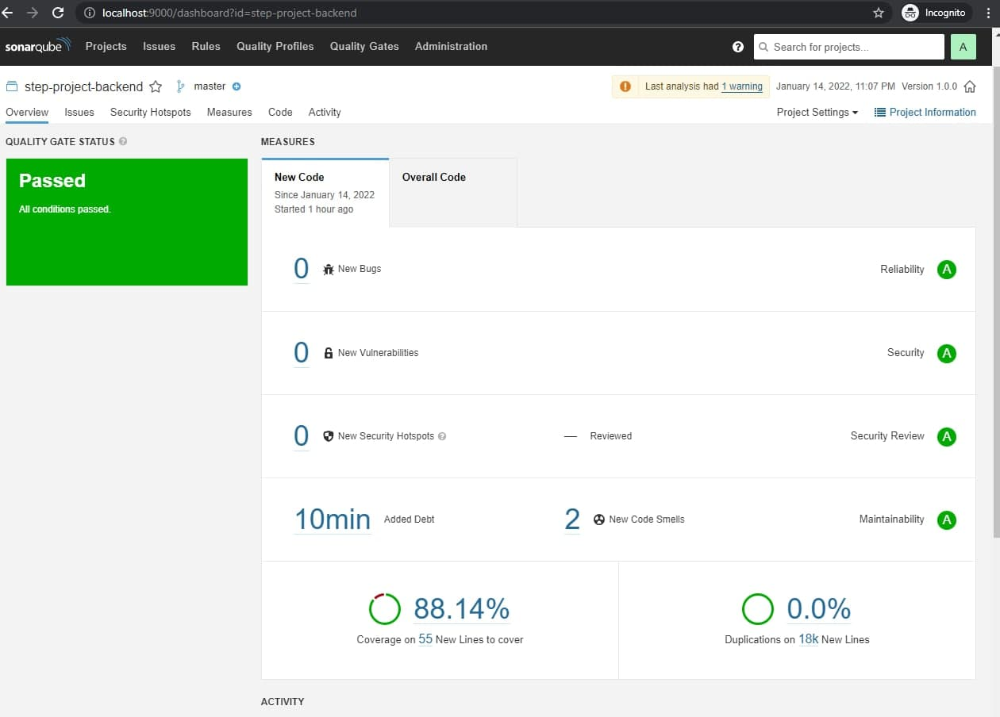

# Implemented Unit Tests with Jest and Supertest

## Localhost MySQL server should be configured in `.env`

```env
SQL_DATABASE_NAME = ""
SQL_USERNAME = ""
SQL_PASSWORD = ""
```

## Running tests

```cmd
npm test
```

## Output should be as following

```cmd
 PASS  tests/main.test.js
  Main Controller Tests
    √ DB connection (130ms)
    √ Add user (/POST) (36ms)
    √ Edit user (/PUT) (31ms)
    √ Get the list of users (/GET) (12ms)
```

## SonarQube analysis

- Pull Sonarqube docker image first:

```cmd
docker-compose -f docker-compose.sonarqube.yml up
```

- Run all the tests

```cmd
npm run test
```

- Run and push the results to Sonarqube server

```cmd
npm run sonar
```

## Result



Note: All the commands should be done on root folder "backend"
